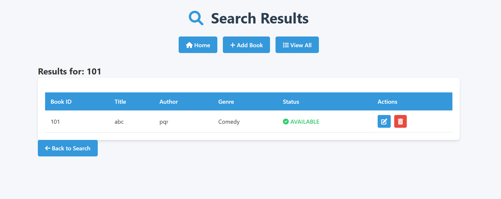

# **Library Management System**  

A web-based **Library Management System** built with **Spring Boot** and **MongoDB** that allows managing books, tracking availability status, and searching inventory.  

  

---

## **Features**  

- **CRUD Operations**: Create, Read, Update, and Delete books  
- **Search Functionality**: Search books by ID or title  
- **Availability Tracking**: Track books as **Available/Checked Out**  
- **Web Interface**: Thymeleaf-based responsive UI  
- **Validation**: Form validation and error handling  
- **MongoDB Integration**: Cloud database storage  
- **Exception Handling**: Custom error pages and messages  
- **Responsive Design**: Works on both desktop and mobile devices  

---

## **Technologies Used**  

### **Backend:**  
- Spring Boot **3.4.2**  
- Spring Data MongoDB  
- Spring Web  
- Lombok  
- Validation API  

### **Frontend:**  
- Thymeleaf  
- CSS3  
- Font Awesome **6**  
- Responsive Design  

### **Database:**  
- MongoDB Atlas (Cloud)  

### **Tools:**  
- Maven  
- Spring Boot DevTools  

---

## **Prerequisites**  

- **JDK 17+**  
- **Maven 3.6+**  
- **MongoDB Atlas account**  
- **Modern web browser**  

---

## **Installation**  

### **1. Clone the repository**  
```bash
git clone https://github.com/yourusername/library-management-system.git
cd library-management-system
```

### **2. Configure MongoDB**  

1. **Create a free cluster on MongoDB Atlas**  
2. **Update the connection string** in `src/main/resources/application.properties`:  

```properties
spring.data.mongodb.uri=mongodb+srv://<username>:<password>@cluster0.mongodb.net/?retryWrites=true&w=majority
```

### **3. Build and Run**  

```bash
mvn clean install
mvn spring-boot:run
```

### **4. Access the Application**  
Open your browser and visit:  
```bash
http://localhost:8080/books
```

---

## **Configuration**  

Update `application.properties` with your MongoDB credentials:  

```properties
spring.data.mongodb.uri=your_mongodb_connection_string
spring.data.mongodb.database=books
spring.application.name=library
```

---

## **API Endpoints**  

| Method | Path                  | Description          |
|--------|-----------------------|----------------------|
| GET    | `/books`              | Home page with statistics |
| GET    | `/books/all`          | List all books      |
| GET    | `/books/add`          | Show add book form  |
| POST   | `/books/add`          | Create new book     |
| GET    | `/books/edit/{id}`    | Show edit form      |
| POST   | `/books/update/{id}`  | Update book         |
| GET    | `/books/delete/{id}`  | Delete book         |
| POST   | `/books/search`       | Search books        |

---

## **Screenshots**  

| Home Page | Add Book | All Books |
|-----------|---------|-----------|
|  |  |  |

| Edit Book | Search Results |
|-----------|---------------|
|  |  |

---

## **Running Tests**  

To run unit tests, execute:  
```bash
mvn test
```

---

## **Contributing**  

Contributions are welcome! Follow these steps:  

1. **Fork the repository**  
2. **Create a feature branch**  
   ```bash
   git checkout -b feature/your-feature
   ```
3. **Commit your changes**  
   ```bash
   git commit -m "Add some feature"
   ```
4. **Push to the branch**  
   ```bash
   git push origin feature/your-feature
   ```
5. **Open a Pull Request**  

---

## **License**  

This project is licensed under the **MIT License** – see the `LICENSE` file for details.  

---

## **Acknowledgments**  

- **Spring Boot Documentation**  
- **MongoDB Atlas**  
- **Thymeleaf Templates**  
- **Font Awesome Icons**  

---

### **To use this README:**  

✅ **Create a `screenshots/` directory** and add actual screenshots.  
✅ **Update the MongoDB connection details** with your actual cluster.  
✅ **Modify the repository URL** in the installation section.  
✅ **Add a `LICENSE` file** if needed.  

Let me know if you need further improvements! 🚀

